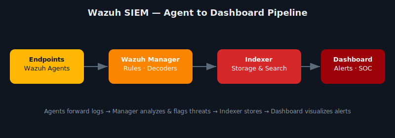

# 🛡️ Wazuh SIEM Installation & Configuration Guide

  

This repository provides a complete guide to installing and configuring **Wazuh**, an open-source Security Information and Event Management (SIEM) platform. Wazuh provides intrusion detection, vulnerability detection, log analysis, file integrity monitoring, and more.



---

## 📘 What Is Wazuh?

[Wazuh](https://wazuh.com/) is an open-source platform that offers unified XDR and SIEM capabilities. It provides real-time security visibility and threat detection across endpoints, cloud environments, and containers.

---

## 📋 Requirements

- OS: Ubuntu 20.04+ or CentOS 7+/RHEL 8+
- At least 4 GB RAM and 2 CPU cores (recommended)
- Root or sudo access
- Internet connection

---

## ⚙️ Components

Wazuh has three main components:

1. **Wazuh Manager** – Analyzes data received from agents.
2. **Wazuh Agent** – Installed on monitored endpoints.
3. **Wazuh Dashboard** – Kibana-based UI to visualize events and alerts.

---

## 🚀 Installation Steps

### 1. Add Wazuh Repository

```bash
curl -s https://packages.wazuh.com/key/GPG-KEY-WAZUH | sudo apt-key add -
echo "deb https://packages.wazuh.com/4.x/apt stable main" | sudo tee /etc/apt/sources.list.d/wazuh.list
```

### 2. Install Wazuh Manager

```bash
sudo apt update
sudo apt install wazuh-manager -y
```

### 3. Install Wazuh Agent (on monitored system)

```bash
sudo apt install wazuh-agent -y
```

### 4. Configure Agent to Connect to Manager

Edit `/var/ossec/etc/ossec.conf` and set the manager IP:

```xml
<server>
  <address>MANAGER_IP</address>
</server>
```

Start the agent:

```bash
sudo systemctl enable wazuh-agent
sudo systemctl start wazuh-agent
```

### 5. Install Wazuh Dashboard

Follow the official Wazuh installation script for full Wazuh Stack (includes Elasticsearch and Kibana):

```bash
curl -sO https://packages.wazuh.com/4.7/wazuh-install.sh
sudo bash wazuh-install.sh -a
```

> This will install and configure Wazuh Manager, Filebeat, Elasticsearch, and Dashboard.

---

## 🔍 Basic Usage

- Log into the Dashboard:  
  `https://<your-server-ip>`  
  Default credentials:  
  `admin / admin`

- Add agents using the dashboard or via command line:
  ```bash
  /var/ossec/bin/manage_agents
  ```

- View alerts and rules in real time

---

## 🎯 What I Learned / Skills Demonstrated

- **SIEM architecture** — how the manager, indexer, and dashboard divide labor (rule evaluation vs. storage/search vs. visualization), instead of treating "SIEM" as one black-box product.
- **Agent-based log collection at scale** — registering and managing agents across endpoints, and what breaks (network, certs, registration) when an agent goes silent.
- **Detection engineering basics** — how rules and decoders turn raw log noise into actionable alerts, and why tuning rules matters as much as deploying the platform.
- **Operational visibility** — the gap between "logs exist somewhere" and "a SOC analyst can actually see and act on a threat in real time."

**Problem solved:** documented a full agent-to-dashboard SIEM deployment so a small team or homelab can get real intrusion/file-integrity visibility without an enterprise budget.

---

## 📚 References

- [Wazuh Official Docs](https://documentation.wazuh.com/)
- [Wazuh GitHub](https://github.com/wazuh/wazuh)
- [Wazuh Installation Guide](https://documentation.wazuh.com/current/installation-guide/index.html)

---

## 🤝 Contributing

Contributions and improvements are welcome! Fork the repo, create a branch, and submit a pull request.

---

## 📄 License

This guide is licensed under the MIT License. See [LICENSE](./MIT%20License.txt) for more information.

---

🛡️ Gain full visibility and protect your infrastructure with Wazuh SIEM.
